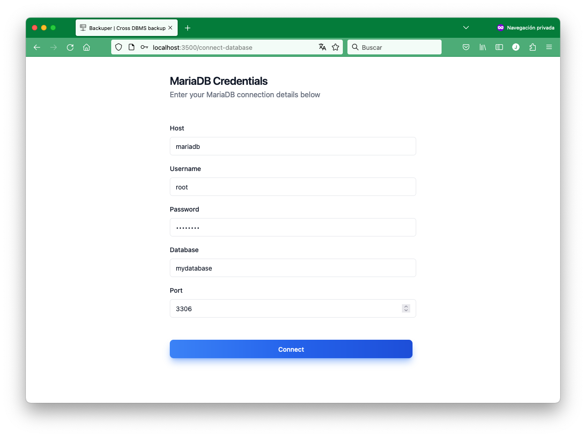
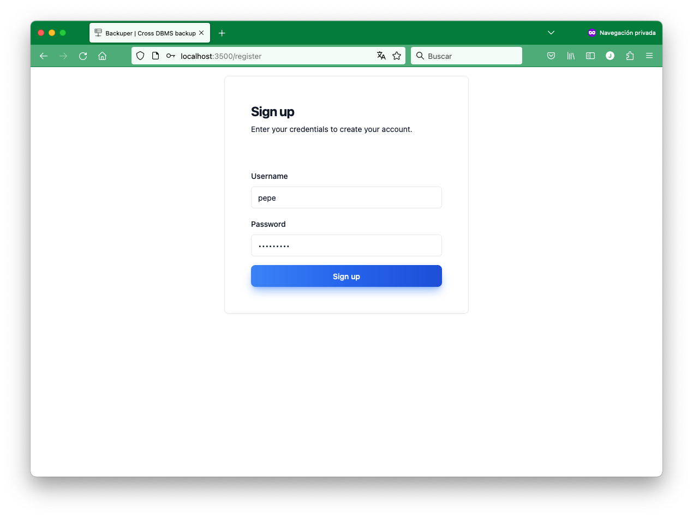
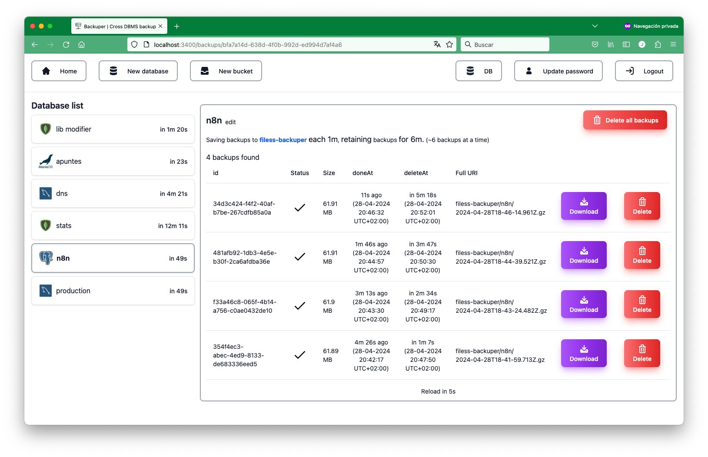

# Backuper

A simple secured platform to backup your databases (MySQL, MariaDB, PostgreSQL and MongoDB) to a s3 compatible storage backend.

## Usage

### Docker

See the [docker-compose.yml](./docker-compose.yml) file for better understanding.

```bash
docker-compose up --build
```
By default a mariadb server will be started with the following credentials:
- `MYSQL_HOST=mariadb`
- `MYSQL_USER=backuper`
- `MYSQL_PASSWORD=${MYSQL_PASSWORD:-notexposablesoweackpassword}`
- `MYSQL_DATABASE=backuper`
- `MYSQL_PORT=3306`

So if you don't explicitly set the `MYSQL_PASSWORD` environment variable, the default password will be used.

## Demo images

> Enter database details


> Create user


> The dashboard


## Development

### Requirements


#### node and npm

See the [package.json](./package.json) "engines" key for better understanding.

```json
{
  "engines": {
    "node": ">=21.7.3",
    "npm": ">=10.5.0"
  }
}
```

To get the versions of node and npm installed on your machine, run the following commands inside project folder:

```bash
nvm install
nvm use
node -v # v21.7.3
npm -v # 10.5.0
```

#### External dependencies

- `mysqldump` (MySQL and MariaDB). Comes in the `mysql-client` package.
- `pg_dump` (PostgreSQL). Comes in the `postgresql-client` package.
- `mongodump` (MongoDB). Comes in the `mongodb-tools` package.

Depending on your OS, you will have different ways to install these dependencies.

### Installation

```bash
npm install
```

### Running the app

```bash
npm run dev
```

## License

MIT License

Copyright (c) 2024 nullx

Permission is hereby granted, free of charge, to any person obtaining a copy
of this software and associated documentation files (the "Software"), to deal
in the Software without restriction, including without limitation the rights
to use, copy, modify, merge, publish, distribute, sublicense, and/or sell
copies of the Software, and to permit persons to whom the Software is
furnished to do so, subject to the following conditions:

The above copyright notice and this permission notice shall be included in all
copies or substantial portions of the Software.

THE SOFTWARE IS PROVIDED "AS IS", WITHOUT WARRANTY OF ANY KIND, EXPRESS OR
IMPLIED, INCLUDING BUT NOT LIMITED TO THE WARRANTIES OF MERCHANTABILITY,
FITNESS FOR A PARTICULAR PURPOSE AND NONINFRINGEMENT. IN NO EVENT SHALL THE
AUTHORS OR COPYRIGHT HOLDERS BE LIABLE FOR ANY CLAIM, DAMAGES OR OTHER
LIABILITY, WHETHER IN AN ACTION OF CONTRACT, TORT OR OTHERWISE, ARISING FROM,
OUT OF OR IN CONNECTION WITH THE SOFTWARE OR THE USE OR OTHER DEALINGS IN THE
SOFTWARE.